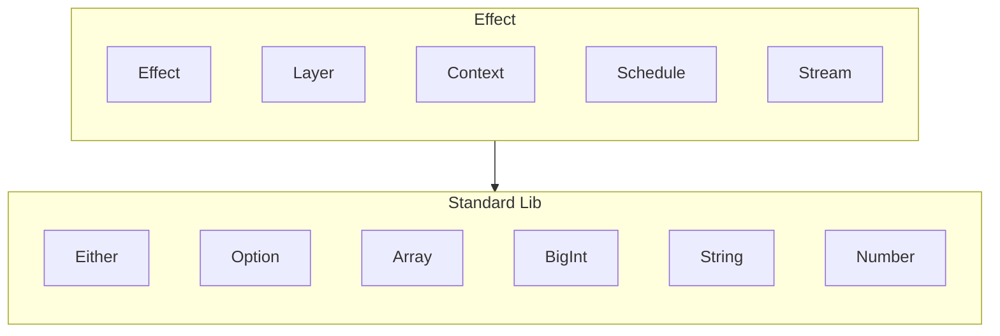

---
# You can also start simply with 'default'
theme: seriph
# random image from a curated Unsplash collection by Anthony
# like them? see https://unsplash.com/collections/94734566/slidev
# some information about your slides (markdown enabled)
title: Welcome to Slidev
info: |
  ## Slidev Starter Template
  Presentation slides for developers.

  Learn more at [Sli.dev](https://sli.dev)
# apply unocss classes to the current slide
class: text-center
# https://sli.dev/features/drawing
drawings:
  persist: false
# slide transition: https://sli.dev/guide/animations.html#slide-transitions
transition: fade-out
# enable MDC Syntax: https://sli.dev/features/mdc
mdc: true
# open graph
# seoMeta:
#  ogImage: https://cover.sli.dev
---

# Effect-TS 介紹

---

# 目錄

- Effect-TS 的由來與 fp-ts 的關係
- Effect-TS 概觀
- Effect 的特色
- 前端不適合應用 Effect
- Effect-TS 標準函式庫的應用

---

# Effect-TS 的由來與 fp-ts 的關係

1. 2023 年初 Effect-TS 誕生
2. 2024 年初 首次發布第一個版本
3. 2025 年預計發布一個大版本(4.0)

如果你用過 fp-ts 你會發現兩者風格非常像，因為 Effect-TS 標準函式庫是由 fp-ts 作者負責的

所以你可以說 Effect-ts 算是 fp-ts 的另一個版本

---

# Effect-TS 概觀



---

# Effect 是什麼？

Effect 專門用來處理各式各樣的副作用（IO、錯誤、資源引用），一個 Effect 的型別涵蓋了三樣東西，結果、錯誤、需求資源，每個 Effect 都可以視為一個 program

```typescript
         ┌─── Produces a value of type number
         │       ┌─── Fails with an Error
         │       │      ┌─── Requires no dependencies
         ▼       ▼      ▼
Effect<number, Error, never>
```

而每個 Effect 又可以與其他 Effect 重組

```typescript
const init = Effect.succeed(2)

const double = (n: number) => Effect.succeed(n * 2)

const program = () => init.pipe(Effect.flatMap(double), Effect.flatMap(double))

Effect.runPromise(program()).then(console.log)
// > 8
```

--- 

# 顯性的錯誤與處理

Effect 在型別層面更加明確地表達可能錯誤的情況，而不像 Promise 只告知成功的執行結果

````md magic-move
```typescript
import { Effect, Data } from "effect";

class HttpError extends Data.TaggedError("HttpError") {}

class ParseError extends Data.TaggedError("ParseError") {}

const failWithHttpError = () => Effect.fail(new HttpError());
const failWithParseError = () => Effect.fail(new ParseError());

const program = () =>
	Effect.succeed("").pipe(
		Effect.flatMap(failWithHttpError),
		Effect.flatMap(failWithParseError),
	);

Effect.runPromise(program());
```

```typescript
import { Effect, Data } from "effect";

class HttpError extends Data.TaggedError("HttpError") {}

class ParseError extends Data.TaggedError("ParseError") {}

const failWithHttpError = () => Effect.fail(new HttpError());
const failWithParseError = () => Effect.fail(new ParseError());

const program = () =>
	Effect.succeed("").pipe(
		Effect.flatMap(failWithHttpError),
		Effect.flatMap(failWithParseError),
        // 處理特定錯誤
		Effect.catchTag("HttpError", () => Effect.succeed("HttpError")),
	);

Effect.runPromise(program());
```

```typescript
import { Effect, Data } from "effect";

class HttpError extends Data.TaggedError("HttpError") {}

class ParseError extends Data.TaggedError("ParseError") {}

const failWithHttpError = () => Effect.fail(new HttpError());
const failWithParseError = () => Effect.fail(new ParseError());

const program = () =>
	Effect.succeed("").pipe(
		Effect.flatMap(failWithHttpError),
		Effect.flatMap(failWithParseError),
		// 處理多個錯誤
		Effect.catchTags({
			HttpError: () => Effect.succeed("http error"),
			ParseError: () => Effect.succeed("parse error"),
		}),
	);

Effect.runPromise(program());
```

```typescript
import { Effect, Data } from "effect";

class HttpError extends Data.TaggedError("HttpError") {}

class ParseError extends Data.TaggedError("ParseError") {}

const failWithHttpError = () => Effect.fail(new HttpError());
const failWithParseError = () => Effect.fail(new ParseError());

const program = () =>
	Effect.succeed("").pipe(
		Effect.flatMap(failWithHttpError),
		Effect.flatMap(failWithParseError),
		// 統一處理所有錯誤
		Effect.catchAll(() => Effect.succeed("fail")),
	);

Effect.runPromise(program());
```
````

--- 

# 資源的引用提示

在 Effect-TS 共用資源的建立與取用會建議使用 `Context` module 來建立 interface，而 `Layer` 則是用來處理組合 `Context` 的實作與其之間的相依關係

```ts twoslash
import { Context, Effect, pipe } from "effect";

class EnvContext extends Context.Tag("EnvContext")<
	EnvContext,
	{
		apiKey: string;
	}
>() {}

const program = pipe(
	EnvContext,
	Effect.flatMap(({ apiKey }) => Effect.succeed(apiKey)),
);

// 你沒有提供 EnvContext 的實作會直接從型別上提示你
Effect.runPromise(program).then(console.log);
```

---

# 提供實作以消除錯誤

```ts {monaco}
import { Context, Effect, pipe } from "effect";

class EnvContext extends Context.Tag("EnvContext")<
	EnvContext,
	{
		apiKey: string;
	}
>() {}

const program = pipe(
	EnvContext,
	Effect.flatMap(({ apiKey }) => Effect.succeed(apiKey)),
);

const providedProgram = program.pipe(
	Effect.provideService(EnvContext, { apiKey: "123" }),
);

Effect.runPromise(providedProgram).then(console.log);
```

---

# 前端不適合應用 Effect

透過前面的範例或是在網路上看各種應用你會慢慢的發現使用 Effect 作為核心開發必然會影響整個專案思維及風格，不適合的點主要以下幾項

- 功能及目的上更適合應用在後端開發
- 前端所面臨的副作用前端框架已經處理掉了
- 風格與前端主流函式庫不契合，需要作非常多的轉換動作
- 學習曲線偏高

---

# Effect-TS 標準函式庫的應用

既然 Effect 不適合用於前端，那我們的關注點就會在標準函式庫的應用上了，主要優勢有幾點

- 本身就是以函數式的思維進行建構，提供了很多好用的函式與功能
  - function currying
  - function composition (pipeline)
  - pattern matching
- 更強調型別的合理性及正確性，不再被 lodash, ramda 這類混亂邪惡的型別所困擾
- 標準函式庫所涵蓋的功能可以涵蓋大部分場景

---

# 函數設計的基本思想

---

# pattern matching 的應用

---

# 缺點

- 官方文件主要在展示想法及痛點，對 API 的講解並不全面
- API 文件的範例稀少，大多得靠閱讀函數名稱或或者型別來推測功能